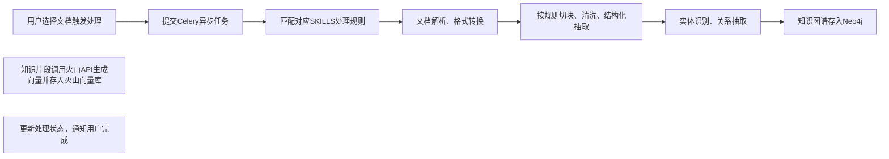
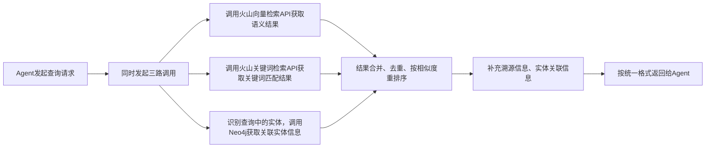

# EKP 企业级知识中台技术设计文档
**版本**：v1.0  
**日期**：2026-05-24  
**状态**：待审核

---

## 一、项目概述
### 1.1 项目定位
前后端分离的纯召回知识中台（RAG中的"R"层），为各类Agent提供结构化知识检索服务，暂不考虑用户登录和数据权限。
### 1.2 核心目标
- 支持全类型文档上传和自定义处理流程
- 构建企业级知识库，实现精准的知识召回
- 提供标准RESTful API，降低Agent集成成本
- 支持人工校验修正，保证知识质量
### 1.3 核心功能
| 功能模块 | 核心能力 |
|---------|---------|
| 知识库管理 | 多知识库隔离、配置管理、统计信息 |
| 文档管理 | 单文件/文件夹上传、版本管理、去重校验、处理状态跟踪 |
| SKILLS配置 | 内置处理模板、自定义规则配置、自定义脚本、AI自动适配 |
| 文档处理 | 全格式解析、多策略切块、向量生成、实体抽取、知识图谱构建 |
| 知识检索 | 混合检索（向量+关键词+图谱关联）、多召回策略、结果溯源 |
| 人工校验 | 错误标记、审核队列、内容修正、重新入库 |
| 管理后台 | 全功能可视化管理、召回测试、系统监控 |
| 对外API | 标准RESTful接口、OpenAPI规范文档 |

---

## 二、技术架构设计
### 2.1 整体架构图
```
┌─────────────────┐    HTTP API     ┌───────────────────────────────────────────────┐
│   Agent调用方   │ ◄──────────────► │  FastAPI接口层 （自研）                        │
└─────────────────┘                 │  - 知识召回接口、管理类接口                      │
                                     │  - OpenAPI自动生成                              │
                                     └─────────────────┬─────────────────────────────┘
                                                       │
┌─────────────────┐    管理后台      ┌─────────────────▼─────────────────────────────┐
│  Vue3管理后台   │ ◄──────────────► │  业务逻辑层（自研）                              │
└─────────────────┘                 │  - 知识库、文档、SKILLS配置管理                  │
                                     │  - 召回编排、结果合并排序                        │
                                     │  - 人工校验工作流                                │
                                     └─────────────────┬─────────────────────────────┘
                                                       │
┌─────────────────┐                 ┌─────────────────▼─────────────────────────────┐
│   Redis消息队列 │ ◄──────────────► │  异步处理层（自研）                              │
└─────────────────┘                 │  - Celery异步任务调度                            │
                                     │  - 全格式文档解析、切块、清洗                    │
                                     │  - 实体识别、关系抽取、图谱构建                  │
                                     │  - 调用火山接口上传向量                          │
                                     └─────────────────┬─────────────────────────────┘
                                                       │
┌─────────────────┐           ┌─────────────────▼─────────────────────────────┐
│  火山向量引擎   │ ◄────────► │  存储层                                        │
└─────────────────┘           │  - PostgreSQL：业务元数据、配置、流程数据        │
                               │  - Neo4j：实体、关系、知识图谱数据               │
                               │  - 本地文件夹：原始文档存储                       │
                               │  - 火山向量库：向量存储、语义/关键词检索能力       │
                               └───────────────────────────────────────────────┘
```
### 2.2 技术栈选型
| 层级 | 技术选型 | 版本要求 | 说明 |
|------|----------|----------|------|
| 后端框架 | FastAPI + Pydantic + Uvicorn | ≥0.100.0 | 高性能Python Web框架，自动生成OpenAPI文档 |
| 异步任务 | Celery + Redis | ≥5.3.0 | 异步任务调度、队列管理 |
| 业务数据库 | PostgreSQL | ≥14.0 | 关系型数据库，存储所有结构化业务数据 |
| 图谱数据库 | Neo4j Community | ≥5.0 | 图数据库，存储实体、关系、知识图谱 |
| 向量引擎 | 火山引擎智能知识库 | - | 托管向量服务，提供向量+关键词检索能力 |
| 文件存储 | 本地文件系统 | - | 原始文档存储，简单易用 |
| 文档处理 | LangChain + Unstructured | ≥0.1.0 | 全格式文档解析、处理工具链 |
| AI能力 | 火山引擎大模型服务 | - | 智能切块、实体抽取、AI自动生成配置 |
| 前端 | Vue3 + Element Plus | ≥3.3.0 | 轻量企业级管理后台 |
| 部署 | Docker Compose | ≥2.0 | 一键部署所有服务 |
### 2.3 各层职责边界
- **接口层**：统一对外接口协议，参数校验、返回格式封装、权限控制（后续扩展）
- **业务逻辑层**：核心业务逻辑实现，包括知识库、文档、SKILLS、检索、审核等全流程
- **异步处理层**：所有耗时的IO/计算任务异步执行，保证接口响应速度
- **存储层**：多组件分工存储，数据隔离，职责单一

---

## 三、核心数据流程
### 3.1 文档上传流程

### 3.2 文档处理流程

### 3.3 知识召回流程（第一阶段实现两种策略）
#### 策略1：并行混合召回（默认）

#### 策略2：原始结果模式

### 3.4 人工校验流程


---

## 四、核心模块设计
### 4.1 知识库管理模块
- **核心功能**：知识库的CRUD、默认SKILLS绑定、召回参数配置、知识库统计
- **核心数据**：知识库ID、名称、描述、默认SKILL_ID、向量模型配置、召回默认参数、创建时间、状态
### 4.2 文档管理模块
- **核心功能**：单文件/文件夹上传、文件列表查询、处理状态跟踪、手动触发处理、版本管理、重复文件校验
- **核心数据**：文档ID、知识库ID、文件名、文件类型、大小、MD5哈希、本地存储路径、上传时间、处理状态、版本号、错误日志
### 4.3 SKILLS配置模块
- **核心功能**：内置模板库管理、自定义处理规则配置、自定义脚本管理、AI自动生成配置
- **核心配置**：切块策略、切块大小、重叠长度、清洗规则、抽取字段列表、实体识别规则、关系抽取规则
### 4.4 文档处理模块
- **核心功能**：全格式文档解析、多策略切块、清洗逻辑、向量生成、实体抽取、关系抽取、任务状态跟踪、失败重试
- **状态管理**：待处理、处理中、成功、失败、部分失败
### 4.5 知识检索模块
- **核心功能**：多策略召回编排、结果合并排序、相似度过滤、溯源信息补充、参数校验
- **可配置参数**：top_k、similarity_threshold、召回策略选择、是否返回实体
### 4.6 人工校验模块
- **核心功能**：错误标记、审核队列管理、内容编辑、重新入库、操作日志、审核统计
### 4.7 API模块
- **对外接口**：知识查询接口、知识库列表接口、文档上传接口（可选开放给Agent）
- **管理接口**：全功能管理类接口，供前端后台调用

---

## 五、核心API定义
### 5.1 知识召回接口（Agent调用）
```http
POST /api/v1/retrieval/query
Content-Type: application/json

{
  "query": "用户查询问题",
  "knowledge_base_id": "知识库ID",
  "top_k": 10,
  "similarity_threshold": 0.7,
  "retrieval_strategy": "hybrid_parallel", // 可选：hybrid_parallel / raw
  "with_entities": false
}

Response:
{
  "code": 0,
  "message": "success",
  "data": {
    "query": "用户查询问题",
    "total": 10,
    "results": [
      {
        "chunk_id": "知识片段ID",
        "content": "知识片段内容",
        "similarity": 0.92,
        "source": {
          "document_id": "所属文档ID",
          "document_name": "文档名称",
          "file_type": "pdf",
          "location": {
            "page": 3,
            "paragraph": 5,
            "position": "第3页第5段"
          }
        },
        "entities": [
          {
            "entity_id": "实体ID",
            "name": "张三",
            "type": "人物"
          }
        ]
      }
    ]
  }
}
```
### 5.2 核心管理接口
| 接口 | 方法 | 说明 |
|------|------|------|
| `/api/v1/knowledge-base` | GET | 获取知识库列表 |
| `/api/v1/knowledge-base` | POST | 创建知识库 |
| `/api/v1/document/upload` | POST | 上传文档 |
| `/api/v1/document/process` | POST | 触发文档处理 |
| `/api/v1/document/task/{task_id}` | GET | 查询处理任务状态 |
| `/api/v1/retrieval/test` | POST | 召回测试接口 |
| `/api/v1/review/task` | GET | 获取审核任务列表 |
| `/api/v1/review/task/{task_id}/process` | POST | 处理审核任务 |

---

## 六、核心数据库设计
### 6.1 PostgreSQL核心表
#### 6.1.1 `knowledge_base` 知识库表
| 字段 | 类型 | 说明 |
|------|------|------|
| `id` | UUID | 主键 |
| `name` | VARCHAR(100) | 知识库名称 |
| `description` | TEXT | 知识库描述 |
| `default_skill_id` | UUID | 默认关联的SKILL配置ID |
| `vector_model_config` | JSONB | 向量模型配置 |
| `retrieval_config` | JSONB | 默认召回参数配置 |
| `status` | SMALLINT | 状态：0-正常 1-禁用 |
| `created_at` | TIMESTAMP | 创建时间 |
| `updated_at` | TIMESTAMP | 更新时间 |
#### 6.1.2 `document` 文档表
| 字段 | 类型 | 说明 |
|------|------|------|
| `id` | UUID | 主键 |
| `kb_id` | UUID | 所属知识库ID |
| `name` | VARCHAR(255) | 文件名 |
| `file_type` | VARCHAR(50) | 文件类型 |
| `size` | BIGINT | 文件大小（字节） |
| `md5` | VARCHAR(32) | 文件MD5哈希（去重用） |
| `storage_path` | VARCHAR(500) | 本地存储路径 |
| `version` | INT | 版本号，默认1 |
| `process_status` | SMALLINT | 处理状态：0-待处理 1-处理中 2-成功 3-失败 |
| `error_log` | TEXT | 处理错误日志 |
| `created_at` | TIMESTAMP | 创建时间 |
| `processed_at` | TIMESTAMP | 处理完成时间 |
#### 6.1.3 `process_task` 处理任务表
| 字段 | 类型 | 说明 |
|------|------|------|
| `id` | UUID | 主键 |
| `kb_id` | UUID | 知识库ID |
| `document_ids` | UUID[] | 关联的文档ID列表 |
| `skill_id` | UUID | 使用的SKILL配置ID |
| `status` | SMALLINT | 任务状态：0-待执行 1-执行中 2-成功 3-失败 |
| `progress` | INT | 处理进度百分比 0-100 |
| `result` | JSONB | 处理结果统计 |
| `created_at` | TIMESTAMP | 创建时间 |
| `finished_at` | TIMESTAMP | 完成时间 |
#### 6.1.4 `skill_config` SKILL配置表
| 字段 | 类型 | 说明 |
|------|------|------|
| `id` | UUID | 主键 |
| `name` | VARCHAR(100) | SKILL名称 |
| `type` | SMALLINT | 类型：0-系统内置 1-用户自定义 |
| `config` | JSONB | 具体配置：切块规则、清洗规则、抽取规则等 |
| `script` | TEXT | 自定义处理脚本（可选） |
| `description` | TEXT | 配置描述 |
| `created_at` | TIMESTAMP | 创建时间 |
| `updated_at` | TIMESTAMP | 更新时间 |
#### 6.1.5 `knowledge_chunk` 知识片段元数据表
| 字段 | 类型 | 说明 |
|------|------|------|
| `id` | UUID | 主键 |
| `document_id` | UUID | 所属文档ID |
| `kb_id` | UUID | 所属知识库ID |
| `volcano_chunk_id` | VARCHAR(100) | 火山向量库中的片段ID |
| `content_hash` | VARCHAR(64) | 内容哈希，去重用 |
| `location_info` | JSONB | 在原始文档中的位置信息 |
| `review_status` | SMALLINT | 审核状态：0-未审核 1-正常 2-错误 3-已修正 |
| `error_info` | JSONB | 错误信息 |
| `created_at` | TIMESTAMP | 创建时间 |
| `updated_at` | TIMESTAMP | 更新时间 |
#### 6.1.6 `review_task` 审核任务表
| 字段 | 类型 | 说明 |
|------|------|------|
| `id` | UUID | 主键 |
| `chunk_id` | UUID | 关联的知识片段ID |
| `error_type` | SMALLINT | 错误类型：0-内容错误 1-切块错误 2-关联错误 3-其他 |
| `error_description` | TEXT | 错误描述 |
| `submitter` | VARCHAR(100) | 提交人 |
| `processor` | VARCHAR(100) | 处理人 |
| `status` | SMALLINT | 状态：0-待处理 1-处理中 2-已完成 3-已忽略 |
| `corrected_content` | TEXT | 修正后的内容 |
| `processed_at` | TIMESTAMP | 处理时间 |
| `created_at` | TIMESTAMP | 创建时间 |
### 6.2 Neo4j核心模型
#### 6.2.1 实体（Entity）
- 核心属性：id、name、type、kb_id、description、source_chunk_ids
- 实体类型：人物、部门、项目、产品、时间、地点、事件、其他
#### 6.2.2 关系（Relation）
- 核心属性：id、from_entity_id、to_entity_id、type、kb_id、description、source_chunk_ids
- 关系类型：属于、负责、关联、包含、时间、地点、其他

---

## 七、火山引擎对接方案
### 7.1 对接能力范围
| 能力 | 说明 |
|------|------|
| 向量存储 | 处理后的知识片段文本和对应向量存入火山智能知识库 |
| 向量检索 | 调用火山API进行语义相似度检索 |
| 关键词检索 | 调用火山API进行BM25关键词检索 |
| 混合检索 | 利用火山内置的混合检索能力，自动合并向量和关键词结果 |
### 7.2 对接方式
- 使用火山官方Python SDK进行调用
- 每个知识库对应火山智能知识库中的一个独立知识库，实现数据隔离
- 知识片段存入火山时，同步保存片段ID和PG中chunk_id的映射关系，用于召回后的信息关联
### 7.3 不使用的火山能力
- 不使用火山的文档处理、自动切块能力，全部自研控制
- 不使用火山的问答生成、在线调试等上层功能，只使用底层检索能力

---

## 八、开发迭代计划
### 第一阶段：MVP核心功能（2周完成）
#### 核心目标：实现可运行的基础版本，具备完整的文档上传-处理-召回流程
| 任务 | 工作量 | 说明 |
|------|--------|------|
| 基础框架搭建 | 3天 | FastAPI项目结构、SQLAlchemy ORM、Celery配置、数据库初始化、火山SDK封装 |
| 知识库+文档管理模块 | 3天 | 知识库CRUD、文件上传、文件列表、处理状态管理 |
| 基础文档处理流程 | 3天 | 文档解析、基础切块、向量生成、火山向量库对接、异步任务调度 |
| 召回接口开发 | 2天 | 并行混合召回、raw模式、结果封装、OpenAPI文档生成 |
| 基础前端页面 | 3天 | 知识库管理、文档上传、召回测试页面 |
| 部署脚本开发 | 1天 | Docker Compose一键部署脚本 |
### 第二阶段：功能完善（1-2周完成）
#### 核心目标：完善SKILLS配置、知识图谱、人工校验等高级功能
| 任务 | 工作量 | 说明 |
|------|--------|------|
| SKILLS配置模块 | 3天 | 模板库、自定义规则配置、AI自动适配 |
| 知识图谱模块 | 3天 | 实体识别、关系抽取、Neo4j对接、图谱关联召回 |
| 人工校验模块 | 2天 | 错误标记、审核队列、内容编辑、重新入库 |
| 系统监控页面 | 2天 | 任务统计、接口调用统计、系统状态监控 |
### 第三阶段：体验优化（1周完成）
#### 核心目标：用户体验优化、性能优化、稳定性提升
| 任务 | 工作量 | 说明 |
|------|--------|------|
| 知识浏览页面 | 2天 | 知识片段查看、图谱可视化 |
| 性能优化 | 2天 | 大文件上传优化、异步任务性能优化、检索性能优化 |
| 错误处理增强 | 1天 | 完善异常处理、重试机制、告警通知 |

---

## 九、部署方案
### 9.1 部署架构
使用Docker Compose一键部署所有服务：
| 服务 | 镜像 | 端口 | 说明 |
|------|------|------|------|
| FastAPI后端 | python:3.10-slim | 8000 | 后端API服务 |
| Celery Worker | python:3.10-slim | - | 异步任务处理节点 |
| Redis | redis:7-alpine | 6379 | 消息队列、缓存 |
| PostgreSQL | postgres:14-alpine | 5432 | 业务数据库 |
| Neo4j | neo4j:5-community | 7474,7687 | 图数据库 |
| Nginx | nginx:alpine | 80 | 前端静态资源服务、反向代理 |
### 9.2 环境变量配置
需要配置的核心环境变量：
```env
# 火山引擎配置
VOLCANO_ACCESS_KEY=xxx
VOLCANO_SECRET_KEY=xxx
VOLCANO_REGION=cn-beijing
VOLCANO_KB_ENDPOINT=xxx

# 数据库配置
POSTGRES_HOST=postgres
POSTGRES_PORT=5432
POSTGRES_DB=ekp
POSTGRES_USER=ekp
POSTGRES_PASSWORD=xxx

# Neo4j配置
NEO4J_URI=bolt://neo4j:7687
NEO4J_USER=neo4j
NEO4J_PASSWORD=xxx

# Redis配置
REDIS_URL=redis://redis:6379/0

# 文件存储配置
FILE_STORAGE_PATH=/data/ekp/files
```

---

## 十、风险与注意事项
1. **火山API限制**：需要提前评估火山接口的调用频率限制、QPS上限、延迟情况，必要时申请扩容
2. **大文件上传**：超过100MB的大文件需要支持断点续传、分片上传，避免超时
3. **异步任务重试**：需要实现合理的重试机制，处理文档解析、向量生成等过程中的临时失败
4. **成本控制**：火山向量库按存储量和调用次数计费，需要做好用量监控，避免不必要的费用支出
5. **数据备份**：PostgreSQL、Neo4j、本地文件都需要定期备份，避免数据丢失
6. **权限控制**：虽然第一阶段不做权限，但设计时要预留权限字段，方便后续扩展
